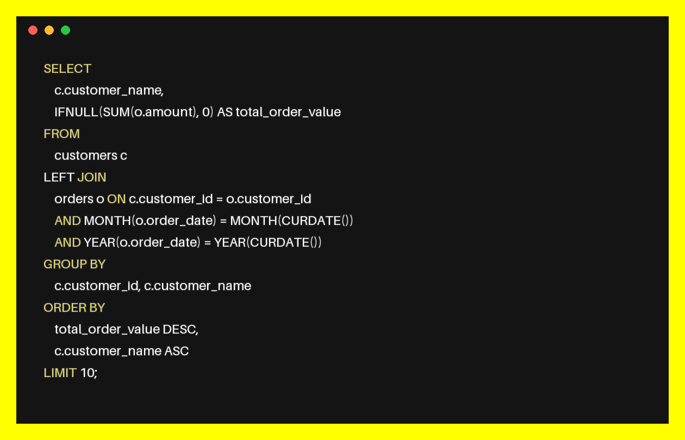

# VSCode Simulated Code Block Image Generator

This Python project generates an image that simulates the appearance of a code block in Visual Studio Code (VSCode) with a dark theme. The code block is highlighted with colors for SQL keywords, and it includes enhancements like a slight shadow and bold effect for the keywords.

## Features

- **Syntax Highlighting**: SQL keywords are highlighted with different colors to resemble syntax highlighting in a code editor.
- **Drop Shadow Effect**: Adds a subtle drop shadow to the text, enhancing its visibility and giving a glowing effect.
- **Bold Keywords**: Keywords are made bold by drawing the text multiple times with slight offsets.
- **VSCode-like Appearance**: The image mimics the look of VSCode, with a dark background, top bar, and simulated toolbox elements.

## Requirements

- Python 3.x
- Pillow library (PIL fork)

## Installation

1. **Clone the repository**:
    ```bash
    git clone https://github.com/yourusername/vscode-simulated-code-block.git
    cd vscode-simulated-code-block
    ```

2. **Install the required packages**:
    ```bash
    pip install Pillow
    ```

## Usage

1. **Customize the code text**:
    Modify the `code_text` variable in the script to include the code you want to display in the image.

2. **Customize keyword colors**:
    Adjust the `keywords_color_mapping` dictionary to define the colors for different SQL keywords.

3. **Run the script**:
    ```bash
    python image_generate.py
    ```

4. **Output**:
    The script will generate an image file named `vscode_simulated_code_block.png` in the same directory, simulating the appearance of the code block in VSCode.

## Example Output

Here's an example of what the generated image might look like:



## Customization

- **Font**: The script uses the default font provided by Pillow. You can change the font by loading a different `.ttf` or `.otf` file.
- **Shadow and Bold Effect**: Modify the `shadow_offset` and `bold_factor` parameters in the `draw_code_block` function to customize the intensity of the shadow and bold effects.
- **VSCode Elements**: Customize the top bar and toolbox elements by modifying the `draw.rectangle` and `draw.ellipse` functions in the script.

## Troubleshooting

- **AttributeError: 'ImageDraw' object has no attribute 'textsize'**: This issue can occur if you are using an outdated method from older Pillow versions. The script uses `textbbox` to measure text size, which is compatible with recent versions of Pillow.

## License

This project is licensed under the MIT License 

## Contributions

Contributions are welcome! Feel free to submit a pull request or open an issue if you have suggestions or find bugs.

## Acknowledgments

- This project is inspired by the need to generate visually appealing code block images for programming-related content.
- Thanks to the developers of the [Pillow library](https://python-pillow.org/) for making image processing in Python easy and accessible.
Generate Image of Code Blocks
